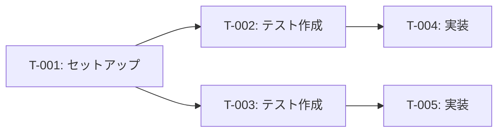

# odin-think-plan

タスク分解・見積もり・実装計画スキル。odin司令塔のthinkフェーズで使用する。
設計ドキュメントと要件定義書を入力として、TDDサイクルを組み込んだタスク一覧・依存関係・並列実行計画（Wave形式）を作成する。

## Instructions

### 完了チェックポイントの原則

各ステップの最後には「完了チェックポイント」を設けている。
チェックポイントに記載された全ての条件を満たさない限り、次のステップに進んではならない。

### コンテキスト検出

$ARGUMENTS を確認し、odinコンテキストJSONが含まれているか判定する。

odinコンテキストJSONの例:
```json
{
  "odin_context": {
    "task": "通知機能の追加",
    "artifacts": {
      "design": ".claude/artifacts/design-20260320-1600.md",
      "requirements": ".claude/artifacts/requirements-20260320-1500.md"
    }
  }
}
```

- odinコンテキストがある場合: artifactsから入力ファイルのパスを取得する
- odinコンテキストがない場合: 成果物管理ルールに従い入力ファイルを探索する

### 成果物管理

入力ファイルの探索順序:
1. $ARGUMENTSにファイルパスが明示指定されていればそれを使う
2. odinコンテキストのartifactsにパスがあればそれを使う
3. `.claude/artifacts/` 内の最新の `design-*.md` と `requirements-*.md` を使う
4. 該当ファイルが見つからない場合はAskUserQuestionでユーザーに確認する

### ステップ1: 入力ファイルの読み込み

1. 設計ドキュメント（design-*.md）を読み込む
2. 要件定義書（requirements-*.md）を読み込む（あれば）
3. コンポーネント設計のファイル一覧と役割を把握する
4. データフロー・依存関係を理解する

#### 完了チェックポイント（ステップ1）

- 設計ドキュメントの内容を把握していること
- 作成・変更が必要なファイルの一覧が明確になっていること
- 実装の全体像が把握できていること

### ステップ2: タスク分解

superpowers:writing-plans のパターンに従い、タスクを分解する。

注: superpowersプラグインが未インストールの場合は、同等の機能を手動で実行する（計画をマークダウン形式で.claude/artifacts/に出力し、TaskCreateでタスク管理する）

タスク分解の原則:
- 各タスクはTDDサイクル（Red → Green → Refactor）で表現する
- 1タスクの粒度: テストの作成〜実装完了まで10〜30分で完了できる作業単位（ステップ4の見積もり基準と整合）
- タスクが大きい場合はサブタスクに分割する
- タスク名は具体的な作業内容がわかるように記述する

TDDサイクルの組み込み方:
- Red: テストを先に書く（失敗するテストコードの作成）
- Green: テストを通す最小限の実装
- Refactor: コードの整理・最適化（テストが通ったまま）

タスクの種類:
1. セットアップタスク（型定義、スキーマ定義等）
2. Red タスク（テストコード作成）
3. Green タスク（実装コード作成）
4. Refactor タスク（リファクタリング）
5. 統合タスク（コンポーネント間の結合）
6. E2Eタスク（エンドツーエンドのテスト）

PRサイズ考慮のタスク分解ルール:
- 各タスクの変更行数を概算する（ファイル数 x 平均行数で推定）
- 1タスク（= 1PR相当）の変更行数がソフトリミット（400行）を超える場合は分割する
- 分割時はVertical Slicing（垂直分割）を優先する（1PRで1つのユーザー価値を提供）
- 分割後の各タスクが独立してテスト可能であることを確認する
- PRサイズガイドライン（pr-sizing.md）の数値基準を参照する

#### 完了チェックポイント（ステップ2）

- 全タスクが10〜30分粒度に分解されていること
- 各タスクにTDDサイクルのフェーズが明記されていること
- タスク数が設計ドキュメントのファイル数と対応していること
- 全タスクの推定行数がソフトリミット（400行）以内であること（超過時は分割済み）

### ステップ3: 依存関係・並列可否の判定

各タスク間の依存関係を特定する:

依存関係の種類:
- 必須依存: タスクAが完了しないとタスクBを開始できない
- 推奨依存: タスクAを先に進めた方が効率が良い
- 独立: 依存関係なし（並列実行可能）

クリティカルパスの特定:
- 依存チェーンが最も長い経路がクリティカルパス
- クリティカルパス上のタスクは優先的に処理する

並列実行グループ（Wave）の作成:
- Wave 1: 依存関係のない最初のタスク群
- Wave 2: Wave 1の完了後に開始できるタスク群
- Wave N: 前のWaveの完了後に開始できるタスク群

#### 完了チェックポイント（ステップ3）

- 全タスクの依存関係が明記されていること
- クリティカルパスが特定されていること
- Wave形式の並列実行グループが作成されていること

### ステップ4: 見積もり

各タスクの見積もりを行う:

見積もりの単位: 分（minutes）
見積もりの基準:
- TDD Red（テスト作成）: 5〜15分/タスク
- TDD Green（実装）: 10〜30分/タスク
- TDD Refactor（リファクタリング）: 5〜15分/タスク
- セットアップ: 5〜20分/タスク
- 統合テスト: 15〜30分/タスク

リスクバッファの追加:
- 低リスクタスク（慣れた実装パターン）: 見積もり × 1.2
- 中リスクタスク（新しいパターン・ライブラリ）: 見積もり × 1.5
- 高リスクタスク（未知の領域・複雑な処理）: 見積もり × 2.0

並列実行を考慮した合計時間:
- 逐次実行の場合: 全タスクの見積もり合計
- 並列実行の場合: クリティカルパスの見積もり合計

#### 完了チェックポイント（ステップ4）

- 全タスクに見積もりが付いていること
- リスクレベルが明記されていること
- 並列実行を考慮した合計時間が計算されていること

### ステップ5: 実装計画の出力

1. `.claude/artifacts/` ディレクトリが存在しなければ作成する
2. 現在時刻を取得し、`yyyyMMdd-HHmm` 形式のタイムスタンプを生成する
3. 以下のフォーマットで実装計画を出力する

出力先: `.claude/artifacts/plan-{yyyyMMdd-HHmm}.md`

```
# 実装計画

作成日: {yyyy-MM-dd HH:mm}
対象機能: {機能の概要}
参照設計: {design-*.md のパス}
参照要件: {requirements-*.md のパス（あれば）}

## サマリー

- タスク総数: {N} タスク
- 逐次実行の場合の見積もり: {合計} 分
- 並列実行の場合の見積もり: {クリティカルパス} 分（Wave数: {N}）
- クリティカルパス: {タスクID} → {タスクID} → ...

## タスク一覧

| ID | タスク名 | TDDフェーズ | 依存タスク | 見積もり(分) | リスク | Wave | 推定行数 | PRサイズ区分 |
|----|---------|-----------|----------|------------|------|------|---------|-----------|
| T-001 | {タスク名} | {Red/Green/Refactor/Setup} | - | {N} | {低/中/高} | {1} | {N}行 | {理想/良好/許容} |
| T-002 | {タスク名} | {Red} | T-001 | {N} | {低} | {1} | {N}行 | {理想/良好/許容} |
...

## タスク詳細

### T-001: {タスク名}

TDDフェーズ: {Red / Green / Refactor / Setup}
担当ファイル: {ファイルパス}
依存タスク: {なし / T-XXX}
見積もり: {N}分（リスク: {低/中/高}）

作業内容:
{具体的な作業内容の説明}

完了基準:
- {確認できる完了状態の記述}

---

### T-002: ...

## 依存関係図

{Mermaid形式のDAG（有向非巡回グラフ）}



## Wave形式並列実行計画

### Wave 1（並列実行可能）
- T-001: {タスク名}（{N}分）
- T-002: {タスク名}（{N}分）

### Wave 2（Wave 1完了後）
- T-003: {タスク名}（{N}分）
- T-004: {タスク名}（{N}分）

### Wave N:
...

## チケット作成

環境: {GitHub Issues / Jira}（自動検出）

| チケットID | タスクID群 | タイトル | 推定行数 | PRサイズ区分 |
|-----------|-----------|---------|---------|-------------|
| (作成後記入) | T-001, T-002 | {チケットタイトル} | {N}行 | {理想/良好/許容} |

チケット作成コマンド:
- GitHub Issues: `gh issue create --title "タイトル" --body "本文"`
- Jira: `mcp__plugin_atlassian_atlassian__createJiraIssue`
```

4. 実装計画の概要をユーザーに提示する
5. odinから呼ばれた場合は、出力ファイルパスをodinに返す

#### 完了チェックポイント（ステップ5）

- `.claude/artifacts/plan-*.md` が出力されていること
- タスク一覧テーブルとタスク詳細が全て記載されていること
- 依存関係図（Mermaid）が出力されていること
- Wave形式の並列実行計画が記載されていること

## Examples

### 通知機能の実装計画作成

ユーザー: 「通知機能の実装計画を作って。設計: design-20260320-1600.md」

```
ステップ1: 入力ファイル読み込み
  設計から: 5ファイル（DBスキーマ、APIルート×2、コンポーネント×2）
  TDD必須

ステップ2: タスク分解
  T-001: Prismaスキーマ定義 (Setup, 10分)
  T-002: 通知作成APIのテスト (Red, 15分, 依存:T-001)
  T-003: 通知一覧取得APIのテスト (Red, 10分, 依存:T-001)
  T-004: 通知作成APIの実装 (Green, 20分, 依存:T-002)
  T-005: 通知一覧取得APIの実装 (Green, 15分, 依存:T-003)
  T-006: 通知コンポーネントのテスト (Red, 15分, 依存:T-005)
  T-007: 通知コンポーネントの実装 (Green, 25分, 依存:T-006)
  T-008: E2Eテスト (統合, 30分, 依存:T-004,T-007)

ステップ3: 依存関係・Wave
  Wave 1: T-001
  Wave 2: T-002, T-003（並列）
  Wave 3: T-004, T-005（並列）
  Wave 4: T-006
  Wave 5: T-007
  Wave 6: T-008

ステップ4: 見積もり
  逐次: 140分、並列: 85分（Wave合計）

ステップ5: 出力
  → .claude/artifacts/plan-20260320-1700.md
```
